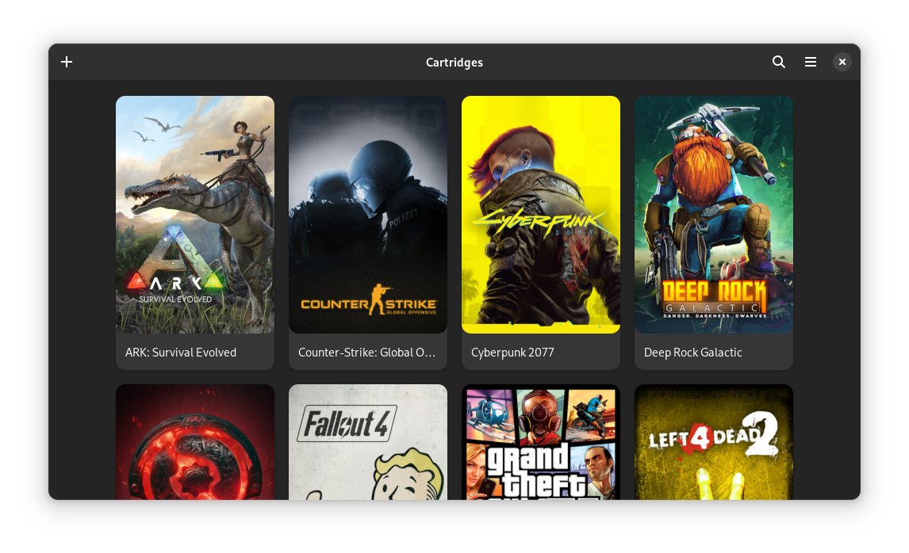

  

 # Cartridges
  
 A GTK4 + Libadwaita game launcher

[![GNOME Circle][circle-image]][circle-url]
[![Flathub][flathub-image]][flathub-url]
[![Build status][github-actions-image]][github-actions-url]
[![Translation Status][weblate-image]][weblate-url]
[![Code style][code-style-image]][code-style-url]
[![Discord][discord-image]][discord-url]

[circle-url]: https://circle.gnome.org
[circle-image]: https://circle.gnome.org/assets/button/badge.svg
[github-actions-url]: https://github.com/kra-mo/cartridges
[github-actions-image]: https://github.com/kra-mo/cartridges/actions/workflows/flatpak-builder.yml/badge.svg
[code-style-url]: https://github.com/psf/black
[code-style-image]: https://img.shields.io/badge/code%20style-black-000000?style=flat
[weblate-url]: https://hosted.weblate.org/engage/cartridges/
[weblate-image]: https://hosted.weblate.org/widgets/cartridges/-/cartridges/svg-badge.svg
[discord-url]: https://discord.gg/4KSFh3AmQR
[discord-image]: https://img.shields.io/discord/1088155799299313754?color=%235865F2&label=discord&logo=discord&logoColor=%23FFFFFF
[flathub-url]: https://flathub.org/apps/hu.kramo.Cartridges
[flathub-image]: https://img.shields.io/flathub/v/hu.kramo.Cartridges

  

# The Project

Cartridges is a simple game launcher written in Python using GTK4 and Libadwaita.

## Features

- Manually adding and editing games
- Importing games from various sources:
  - Steam
  - Lutris
  - Heroic
  - Bottles
  - itch
  - Legendary
  - Flatpak
- Hiding games
- Searching and sorting by title, date added and last played
- Automatically downloading cover art from [SteamGridDB](https://www.steamgriddb.com/)
- Searching for games on various databases
- Animated covers

For updates and questions, join our [Discord server][discord-url]!

# Installation

## Linux

### Flathub

The app is available on Flathub.

## Windows

### From Releases

1. Download the latest release from [Releases](https://github.com/kra-mo/cartridges/releases).
2. Run the downloaded installer.

Note: Windows might present you with a warning when trying to install the app. This is expected, just ignore the warning.

### Winget

Install the latest release with the command: `winget install cartridges`. 

## Building manually

See [Building](https://github.com/kra-mo/cartridges/blob/main/CONTRIBUTING.md#building).

# Contributing

See [CONTRIBUTING.md](https://github.com/kra-mo/cartridges/blob/main/CONTRIBUTING.md).

Thanks to [Weblate](https://weblate.org/) for hosting our translations!

# Code of Conduct

The project follows the [GNOME Code of Conduct](https://wiki.gnome.org/Foundation/CodeOfConduct).

See [CODE_OF_CONDUCT.md](https://github.com/kra-mo/cartridges/blob/main/CODE_OF_CONDUCT.md).
