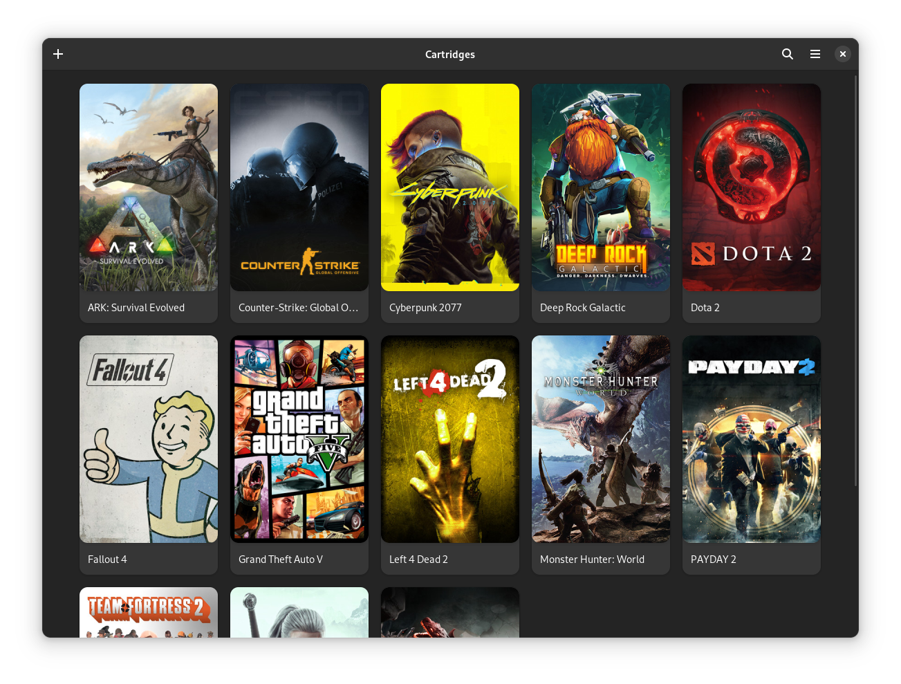

  

 # Cartridges
 A GTK4 + Libadwaita game launcher
  
[![Build status][github-actions-image]][github-actions-url]
[![Translation Status][weblate-image]][weblate-url]
[![Merged PRs][prs-merged-image]][prs-merged-url]
[![License][license-image]][license-url]
[![Code style][code-style-image]][code-style-url]
  
[github-actions-url]: https://github.com/kra-mo/cartridges
[github-actions-image]: https://img.shields.io/github/actions/workflow/status/kra-mo/cartridges/flatpak-builder.yml?branch=main&label=build
[prs-merged-url]: https://github.com/kra-mo/cartridges/pulls?q=is:pr+is:merged
[prs-merged-image]: https://img.shields.io/github/issues-pr-closed-raw/kra-mo/cartridges.svg?label=merged+PRs&color=green
[license-url]: https://github.com/kra-mo/cartridges/blob/main/LICENSE
[license-image]: https://img.shields.io/github/license/kra-mo/cartridges
[code-style-url]: https://github.com/psf/black
[code-style-image]: https://img.shields.io/badge/code%20style-black-000000?style=flat
[weblate-url]: https://hosted.weblate.org/engage/cartridges/
[weblate-image]: https://hosted.weblate.org/widgets/cartridges/-/cartridges/svg-badge.svg

  

# The Project
Cartridges is a simple game launcher written in Python using GTK4 + Libadwaita.
## Features
- Manually adding and editing games
- Importing games from Steam, Heroic and Bottles
- Hiding games
- Searching and sorting by title, date added and last played

# Installation

## Linux

### From Releases
1. Install `org.gnome.Platform` from the [gnome-nightly repository](https://wiki.gnome.org/Apps/Nightly) if needed.
2. Download the latest release from [Releases](https://github.com/kra-mo/cartridges/releases).
3. Install it via GNOME Software or `flatpak install hu.kramo.Cartridges.flatpak`.

## Windows

### From Releases
1. Download the latest release from [Releases](https://github.com/kra-mo/cartridges/releases).
2. Run the downloaded installer.

Note: Windows might present you with a warning when trying to install the app. This is expected, just ignore the warning.

# Contributing

See [CONTRIBUTING](https://github.com/kra-mo/cartridges/blob/main/CONTRIBUTING.md).

Thanks to [Weblate](https://weblate.org/) for hosting our translations!
